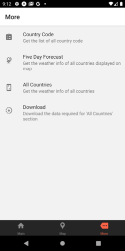

# Weather App

WeatherApp is a weather application made with React-Native and OpenWeather API

## Features

- Real-time weather data for all the countries in the world
- Five day weather forecast.

## Tech

This application uses a number of open source projects to work properly:

- [React Native] - Javascript framework to create mobile application..
- [Expo] -  open-source platform for making universal native apps for Android, iOS, and the web with JavaScript and React.
- [OpenWeather] - The data shown in the appilcation is received through OpenWeatherAPI API..
- [React-native-paper] - Paper is a collection of customizable and production-ready components for React Native, following Google's Material Design guidelines.

And of course this application itself is open source with every code available here in github.

## Installation

Requires [Node.js](https://nodejs.org/) v10+ to run.

Install the dependencies and start the server.

```sh
cd WeatherApp
npm install
npm start
```

## Screenshot

##### Main


##### Map


##### More


##### Country Code


##### Five Day Forecast


##### All Countries Weather
- Weather details of over 200 countries available. 
- User has to swipe right in order to access the details.
(Note: For demonstration purpose, only two screenshots are being shown.)
- 
  

## Development

Want to contribute? Great!

WeatherApp uses React Native + Expo for fast developing.
Make a change in your file and instantaneously see your updates!

Open your favorite Terminal and run these commands.

Terminal:

```sh
cd WeatherApp
npm start
```

Browser:

```sh
Open port 19002
choose the device or emulator as per your choice
```

Emulator/Device:

```sh
Start coding
```

## Note

- The 'All Countries' screen in the application requires the data to be downloaded by using the "Download" option in the "More" page.
- You can search the city by two ways , one by providing only the city name (eg: "Norway") , the second option is by providing both city as well as country name (eg: "Norway, NO"). By this way, you can be more precise in searching the weather of a location.


<!-- ## License

MIT -->


